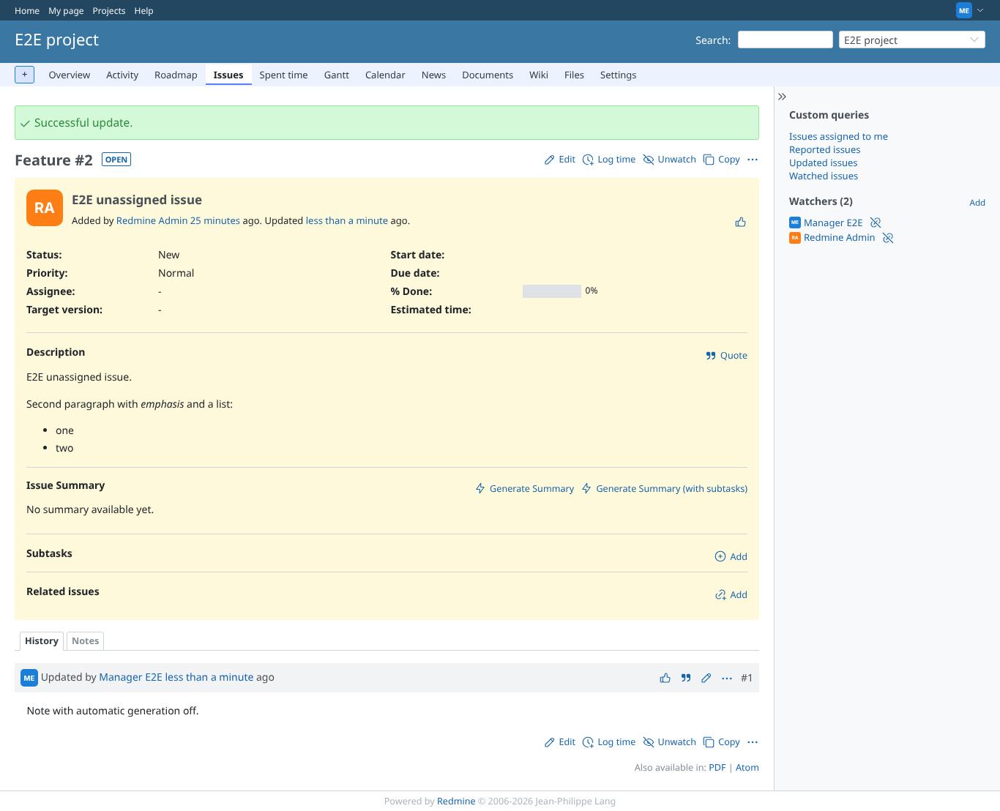
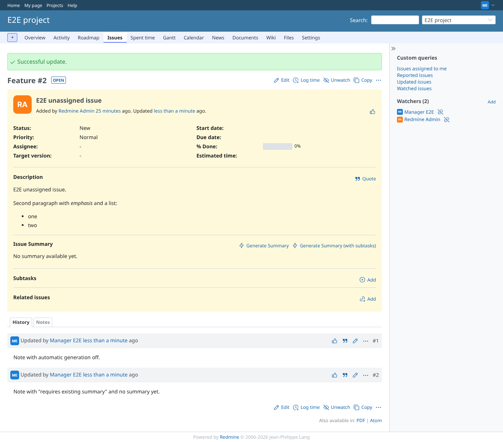
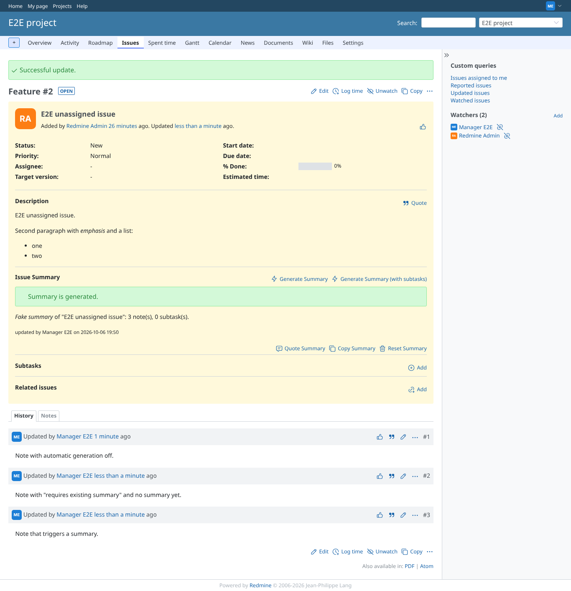
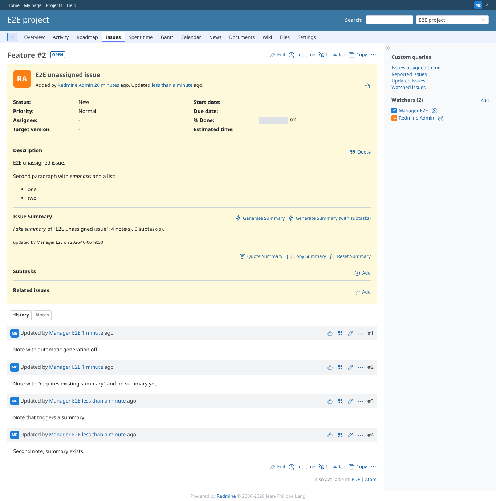

# auto_generate

Run 2026-10-06T19:50:39.494Z against http://127.0.0.1:3000.

| screenshot | user | URL | shows |
|---|---|---|---|
|  | manager | `/issues/2` | Automatic generation off: adding a note leaves the issue without a summary |
|  | manager | `/issues/2` | Automatic generation on, "only when a summary exists": no summary yet, so the note triggers nothing |
|  | manager | `/issues/2` | Automatic generation on: the note started a generation and the page polled the new summary in |
|  | manager | `/issues/2` | "Only when a summary exists" with a summary: the note regenerated it |
