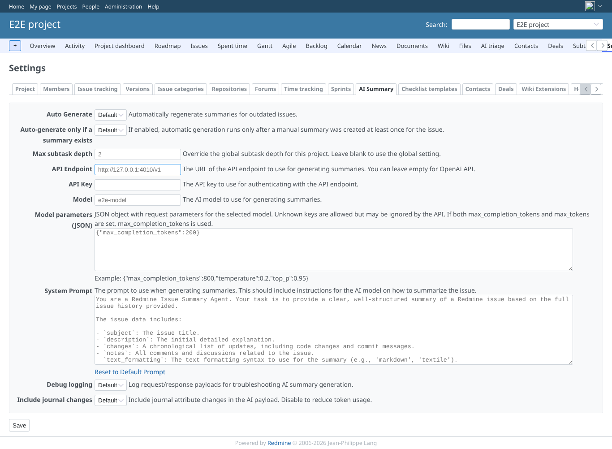
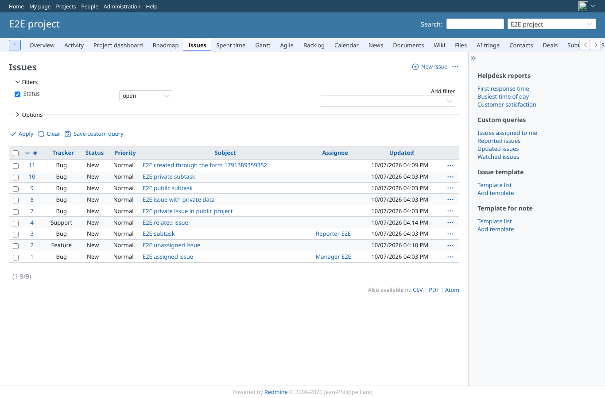
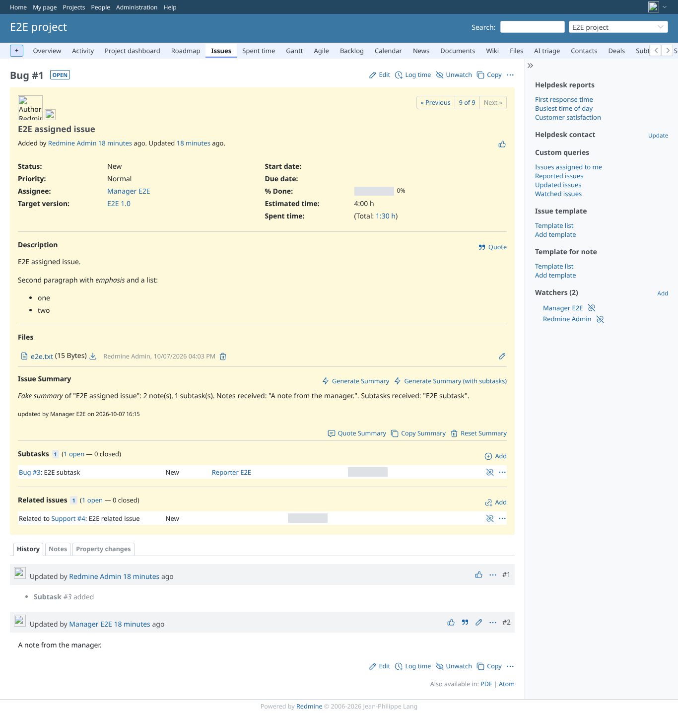
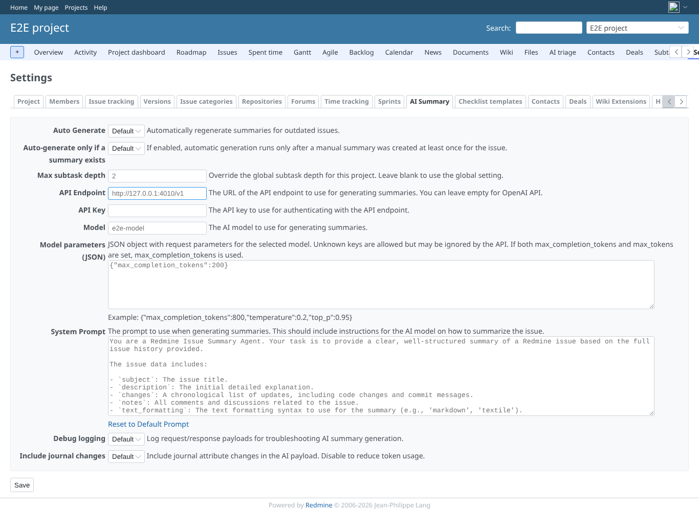
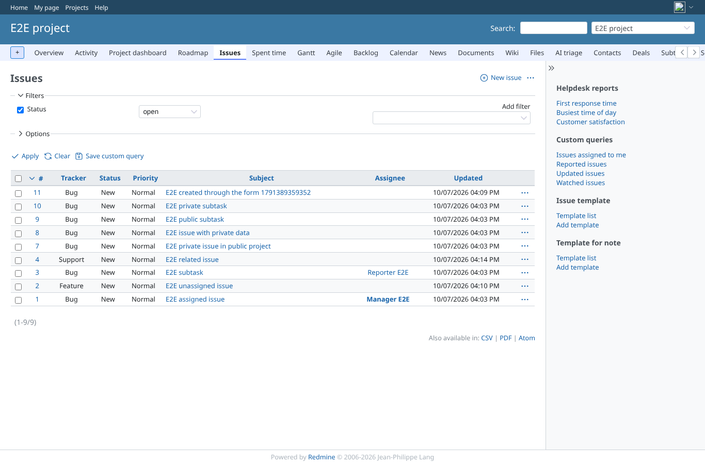
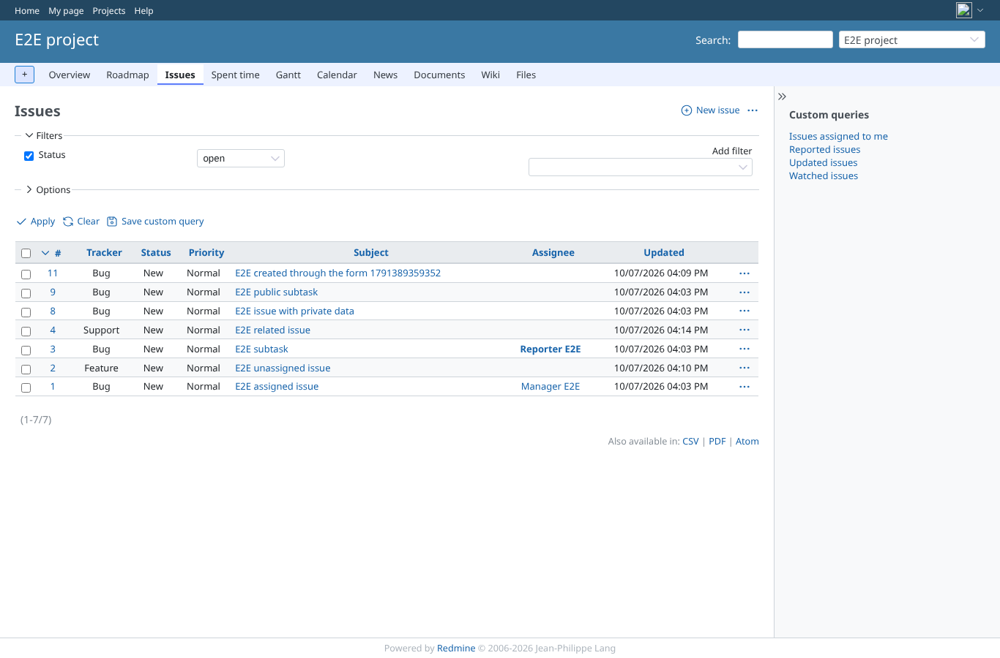

# combination_geoxyz_plugins-32-plugins

Run 2026-10-07T16:21:50.177Z against http://127.0.0.1:3000.

| screenshot | user | URL | shows |
|---|---|---|---|
|  | anonymous | `/projects/e2e-project/settings/ai_summary` | admin: Project > Settings answers 200 with the other GEOxyz plugins, AI summary tab shown |
|  | anonymous | `/projects/e2e-project/issues` | admin: the issue list answers 200 |
|  | anonymous | `/issues/1` | admin: the issue page answers 200 with the AI summary block |
|  | anonymous | `/projects/e2e-project/settings/ai_summary` | manager: Project > Settings answers 200 with the other GEOxyz plugins, AI summary tab shown |
|  | anonymous | `/projects/e2e-project/issues` | manager: the issue list answers 200 |
|  | anonymous | `/issues/1` | manager: the issue page answers 200 with the AI summary block |
|  | anonymous | `/projects/e2e-project/issues` | reporter: project settings refused (403), the issue list answers 200; the summary of an issue redmine_view_issue_description refuses to them is refused too (403) |
|  | anonymous | `/projects/e2e-private/settings/ai_summary` | outsider: settings of the private project refused (403) |
