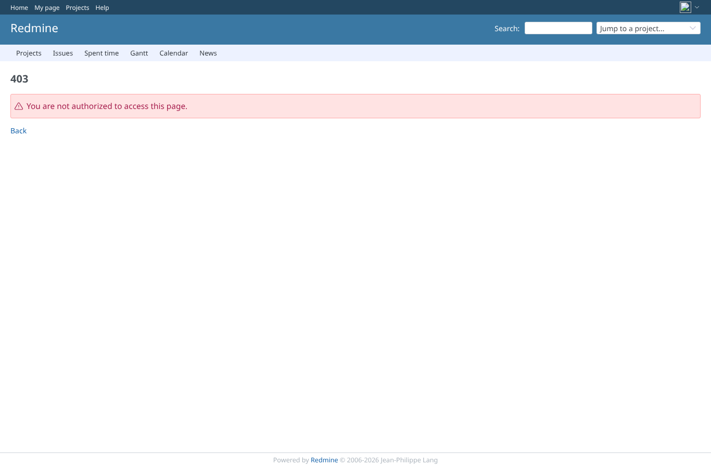

# combination_geoxyz_plugins-34-plugins

Run 2026-10-07T16:19:16.549Z against http://127.0.0.1:3000.

| screenshot | user | URL | shows |
|---|---|---|---|
|  | admin | `/projects/e2e-project/settings/ai_summary` | admin: Project > Settings answers 200 with the other GEOxyz plugins, AI summary tab shown |
|  | admin | `/projects/e2e-project/issues` | admin: the issue list answers 200 |
|  | admin | `/issues/1` | admin: the issue page answers 200 with the AI summary block |
|  | manager | `/projects/e2e-project/settings/ai_summary` | manager: Project > Settings answers 200 with the other GEOxyz plugins, AI summary tab shown |
|  | manager | `/projects/e2e-project/issues` | manager: the issue list answers 200 |
|  | manager | `/issues/1` | manager: the issue page answers 200 with the AI summary block |
|  | reporter | `/projects/e2e-project/issues` | reporter: project settings refused (403), the issue list answers 200 |
|  | outsider | `/projects/e2e-private/settings/ai_summary` | outsider: settings of the private project refused (403) |

## Problems

- login admin: JS zeneditNotificationsConsumer is not defined
- login admin: JS setSelect2Filter is not defined
- login admin: JS setSelect2Filter is not defined
- login admin: JS setSelect2Filter is not defined
- login admin: JS setSelect2Filter is not defined
- login admin: JS setSelect2Filter is not defined
- login admin: JS setSelect2Filter is not defined
- login admin: JS setSelect2Filter is not defined
- login admin: JS setSelect2Filter is not defined
- login admin: JS RedmineStealth is not defined
- login admin: 404 stylesheet /assets/plugin_assets/redmineup/redmineup.css
- login admin: 404 stylesheet /assets/plugin_assets/bless_this_redmine_sso/bless_this_redmine_sso.css
- login admin: 404 stylesheet /assets/plugin_assets/redmine_agile/redmine_agile.css
- login admin: 404 stylesheet /assets/plugin_assets/redmine_ldap_sync/ldap_sync.css
- login admin: 404 stylesheet /assets/plugin_assets/redmine_checklists/checklists.css
- login admin: 404 stylesheet /assets/plugin_assets/redmine_mermaid_macro/redmine_mermaid_macro.css
- login admin: 404 stylesheet /assets/plugin_assets/redmine_people/redmine_people.css
- login admin: 404 stylesheet /assets/plugin_assets/redmine_stealth/stealth.css
- login admin: 404 stylesheet /assets/plugin_assets/view_customize/view_customize.css
- login admin: 404 stylesheet /assets/plugin_assets/redmine_contacts_helpdesk/helpdesk.css
- login admin: 404 stylesheet /assets/plugin_assets/redmine_drawio/drawioEditor.css
- login admin: 404 stylesheet /assets/plugin_assets/redmine_view_issue_description/redmine_view_issue_description.css
- login admin: 404 stylesheet /assets/plugin_assets/redmine_issue_templates/issue_templates.css
- login admin: 404 stylesheet /assets/plugin_assets/redmine_zenedit/zenedit.css
- login admin: 404 stylesheet /assets/plugin_assets/redmineup_tags/redmine_tags.css
- login admin: 404 stylesheet /assets/plugin_assets/redmine_contacts/contacts.css
- login admin: 404 script /assets/plugin_assets/redmineup/consumer.js
- login admin: 404 script /assets/plugin_assets/redmineup/select2.js
- login admin: 404 script /assets/plugin_assets/redmine_contacts/contacts.js
- login admin: 404 script /assets/plugin_assets/redmine_checklists/checklists.js
- login admin: 404 script /assets/plugin_assets/redmineup/select2_helpers.js
- login admin: 404 script /assets/plugin_assets/redmine_zenedit/textarea_caret_position.js
- login admin: 404 script /assets/plugin_assets/redmine_zenedit/zenedit.js
- login admin: 404 script /assets/plugin_assets/redmineup/jquery.colorPicker.min.js
- login admin: 404 script /assets/plugin_assets/redmine_zenedit/zenedit_notifications_consumer.js
- login admin: 404 script /assets/plugin_assets/redmineup_tags/redmine_tags.js
- login admin: 404 script /assets/plugin_assets/redmine_stealth/stealth.js
- /projects/e2e-project/settings as admin: HTTP 500, expected 200
- /projects/e2e-project/settings/ai_summary as admin: HTTP 500, expected 200
- assert: admin: AI summary tab present
- /projects/e2e-project/issues as admin: HTTP 500, expected 200
- /issues/1 as admin: HTTP 500, expected 200
- assert: admin: summary block on the issue page
- login manager: JS zeneditNotificationsConsumer is not defined
- login manager: JS setSelect2Filter is not defined
- login manager: JS setSelect2Filter is not defined
- login manager: JS setSelect2Filter is not defined
- login manager: JS setSelect2Filter is not defined
- login manager: JS setSelect2Filter is not defined
- login manager: JS setSelect2Filter is not defined
- login manager: JS setSelect2Filter is not defined
- login manager: JS setSelect2Filter is not defined
- login manager: JS RedmineStealth is not defined
- login manager: 404 stylesheet /assets/plugin_assets/redmineup/redmineup.css
- login manager: 404 stylesheet /assets/plugin_assets/bless_this_redmine_sso/bless_this_redmine_sso.css
- login manager: 404 stylesheet /assets/plugin_assets/redmine_agile/redmine_agile.css
- login manager: 404 stylesheet /assets/plugin_assets/redmine_mermaid_macro/redmine_mermaid_macro.css
- login manager: 404 stylesheet /assets/plugin_assets/redmine_checklists/checklists.css
- login manager: 404 stylesheet /assets/plugin_assets/redmine_drawio/drawioEditor.css
- login manager: 404 stylesheet /assets/plugin_assets/redmine_people/redmine_people.css
- login manager: 404 stylesheet /assets/plugin_assets/redmine_stealth/stealth.css
- login manager: 404 stylesheet /assets/plugin_assets/view_customize/view_customize.css
- login manager: 404 stylesheet /assets/plugin_assets/redmine_contacts_helpdesk/helpdesk.css
- login manager: 404 stylesheet /assets/plugin_assets/redmine_issue_templates/issue_templates.css
- login manager: 404 stylesheet /assets/plugin_assets/redmine_view_issue_description/redmine_view_issue_description.css
- login manager: 404 stylesheet /assets/plugin_assets/redmine_contacts/contacts.css
- login manager: 404 stylesheet /assets/plugin_assets/redmine_zenedit/zenedit.css
- login manager: 404 stylesheet /assets/plugin_assets/redmineup_tags/redmine_tags.css
- login manager: 404 stylesheet /assets/plugin_assets/redmine_ldap_sync/ldap_sync.css
- login manager: 404 script /assets/plugin_assets/redmineup/select2.js
- login manager: 404 script /assets/plugin_assets/redmineup/consumer.js
- login manager: 404 script /assets/plugin_assets/redmine_contacts/contacts.js
- login manager: 404 script /assets/plugin_assets/redmineup/select2_helpers.js
- login manager: 404 script /assets/plugin_assets/redmine_checklists/checklists.js
- login manager: 404 script /assets/plugin_assets/redmineup/jquery.colorPicker.min.js
- login manager: 404 script /assets/plugin_assets/redmine_zenedit/textarea_caret_position.js
- login manager: 404 script /assets/plugin_assets/redmine_zenedit/zenedit_notifications_consumer.js
- login manager: 404 script /assets/plugin_assets/redmineup_tags/redmine_tags.js
- login manager: 404 script /assets/plugin_assets/redmine_stealth/stealth.js
- login manager: 404 script /assets/plugin_assets/redmine_zenedit/zenedit.js
- /projects/e2e-project/settings as manager: HTTP 500, expected 200
- /projects/e2e-project/settings/ai_summary as manager: HTTP 500, expected 200
- assert: manager: AI summary tab present
- /projects/e2e-project/issues as manager: HTTP 500, expected 200
- /issues/1 as manager: HTTP 500, expected 200
- assert: manager: summary block on the issue page
- login reporter: JS zeneditNotificationsConsumer is not defined
- login reporter: JS setSelect2Filter is not defined
- login reporter: JS setSelect2Filter is not defined
- login reporter: JS setSelect2Filter is not defined
- login reporter: JS setSelect2Filter is not defined
- login reporter: JS setSelect2Filter is not defined
- login reporter: JS setSelect2Filter is not defined
- login reporter: JS setSelect2Filter is not defined
- login reporter: JS setSelect2Filter is not defined
- login reporter: JS RedmineStealth is not defined
- login reporter: 404 stylesheet /assets/plugin_assets/redmineup/redmineup.css
- login reporter: 404 stylesheet /assets/plugin_assets/bless_this_redmine_sso/bless_this_redmine_sso.css
- login reporter: 404 stylesheet /assets/plugin_assets/redmine_agile/redmine_agile.css
- login reporter: 404 stylesheet /assets/plugin_assets/redmine_drawio/drawioEditor.css
- login reporter: 404 stylesheet /assets/plugin_assets/redmine_ldap_sync/ldap_sync.css
- login reporter: 404 stylesheet /assets/plugin_assets/redmine_mermaid_macro/redmine_mermaid_macro.css
- login reporter: 404 stylesheet /assets/plugin_assets/redmine_people/redmine_people.css
- login reporter: 404 stylesheet /assets/plugin_assets/redmine_stealth/stealth.css
- login reporter: 404 stylesheet /assets/plugin_assets/redmine_checklists/checklists.css
- login reporter: 404 stylesheet /assets/plugin_assets/redmine_contacts_helpdesk/helpdesk.css
- login reporter: 404 stylesheet /assets/plugin_assets/redmine_issue_templates/issue_templates.css
- login reporter: 404 stylesheet /assets/plugin_assets/redmine_view_issue_description/redmine_view_issue_description.css
- login reporter: 404 stylesheet /assets/plugin_assets/redmine_contacts/contacts.css
- login reporter: 404 stylesheet /assets/plugin_assets/view_customize/view_customize.css
- login reporter: 404 stylesheet /assets/plugin_assets/redmineup_tags/redmine_tags.css
- login reporter: 404 stylesheet /assets/plugin_assets/redmine_zenedit/zenedit.css
- login reporter: 404 script /assets/plugin_assets/redmineup/consumer.js
- login reporter: 404 script /assets/plugin_assets/redmineup/select2.js
- login reporter: 404 script /assets/plugin_assets/redmineup/select2_helpers.js
- login reporter: 404 script /assets/plugin_assets/redmine_contacts/contacts.js
- login reporter: 404 script /assets/plugin_assets/redmineup/jquery.colorPicker.min.js
- login reporter: 404 script /assets/plugin_assets/redmine_checklists/checklists.js
- login reporter: 404 script /assets/plugin_assets/redmine_zenedit/zenedit.js
- login reporter: 404 script /assets/plugin_assets/redmine_zenedit/zenedit_notifications_consumer.js
- login reporter: 404 script /assets/plugin_assets/redmine_zenedit/textarea_caret_position.js
- login reporter: 404 script /assets/plugin_assets/redmineup_tags/redmine_tags.js
- login reporter: 404 script /assets/plugin_assets/redmine_stealth/stealth.js
- /projects/e2e-project/issues as reporter: HTTP 500, expected 200
- login outsider: JS zeneditNotificationsConsumer is not defined
- login outsider: JS setSelect2Filter is not defined
- login outsider: JS setSelect2Filter is not defined
- login outsider: JS setSelect2Filter is not defined
- login outsider: JS setSelect2Filter is not defined
- login outsider: JS setSelect2Filter is not defined
- login outsider: JS setSelect2Filter is not defined
- login outsider: JS setSelect2Filter is not defined
- login outsider: JS setSelect2Filter is not defined
- login outsider: JS RedmineStealth is not defined
- login outsider: 404 stylesheet /assets/plugin_assets/redmineup/redmineup.css
- login outsider: 404 stylesheet /assets/plugin_assets/bless_this_redmine_sso/bless_this_redmine_sso.css
- login outsider: 404 stylesheet /assets/plugin_assets/redmine_agile/redmine_agile.css
- login outsider: 404 stylesheet /assets/plugin_assets/redmine_ldap_sync/ldap_sync.css
- login outsider: 404 stylesheet /assets/plugin_assets/redmine_checklists/checklists.css
- login outsider: 404 stylesheet /assets/plugin_assets/redmine_mermaid_macro/redmine_mermaid_macro.css
- login outsider: 404 stylesheet /assets/plugin_assets/redmine_people/redmine_people.css
- login outsider: 404 stylesheet /assets/plugin_assets/redmine_stealth/stealth.css
- login outsider: 404 stylesheet /assets/plugin_assets/view_customize/view_customize.css
- login outsider: 404 stylesheet /assets/plugin_assets/redmine_contacts_helpdesk/helpdesk.css
- login outsider: 404 stylesheet /assets/plugin_assets/redmine_issue_templates/issue_templates.css
- login outsider: 404 stylesheet /assets/plugin_assets/redmine_view_issue_description/redmine_view_issue_description.css
- login outsider: 404 stylesheet /assets/plugin_assets/redmine_contacts/contacts.css
- login outsider: 404 stylesheet /assets/plugin_assets/redmine_zenedit/zenedit.css
- login outsider: 404 stylesheet /assets/plugin_assets/redmineup_tags/redmine_tags.css
- login outsider: 404 stylesheet /assets/plugin_assets/redmine_drawio/drawioEditor.css
- login outsider: 404 script /assets/plugin_assets/redmineup/consumer.js
- login outsider: 404 script /assets/plugin_assets/redmineup/jquery.colorPicker.min.js
- login outsider: 404 script /assets/plugin_assets/redmineup/select2_helpers.js
- login outsider: 404 script /assets/plugin_assets/redmineup/select2.js
- login outsider: 404 script /assets/plugin_assets/redmine_contacts/contacts.js
- login outsider: 404 script /assets/plugin_assets/redmine_checklists/checklists.js
- login outsider: 404 script /assets/plugin_assets/redmine_zenedit/zenedit.js
- login outsider: 404 script /assets/plugin_assets/redmine_zenedit/zenedit_notifications_consumer.js
- login outsider: 404 script /assets/plugin_assets/redmine_zenedit/textarea_caret_position.js
- login outsider: 404 script /assets/plugin_assets/redmine_stealth/stealth.js
- login outsider: 404 script /assets/plugin_assets/redmineup_tags/redmine_tags.js
