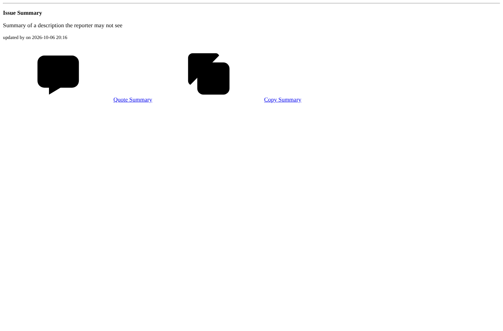
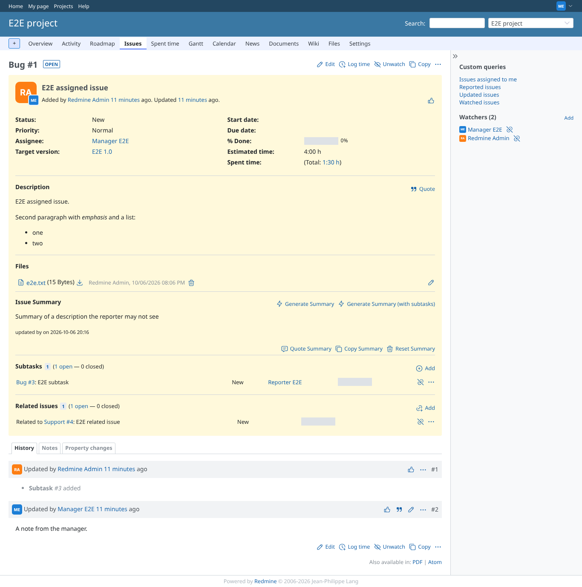

# combination_view_issue_description-before (visibility fix only, without the combination fix)

Run 2026-10-06T20:16:46.388Z against http://127.0.0.1:3000.

| screenshot | user | URL | shows |
|---|---|---|---|
|  | reporter | `/issues/1` | Reporter without view_issue_description: redmine_view_issue_description refuses the issue |
|  | reporter | `/issues/1/ai_summaries/content` | GET /issues/1/ai_summaries/content as the reporter: HTTP 200, summary text LEAKED |
|  | manager | `/issues/1` | Manager (has view_issue_description): issue and summary shown as usual |

## Problems

- /issues/1/ai_summaries/content as reporter: HTTP 200, expected 403
