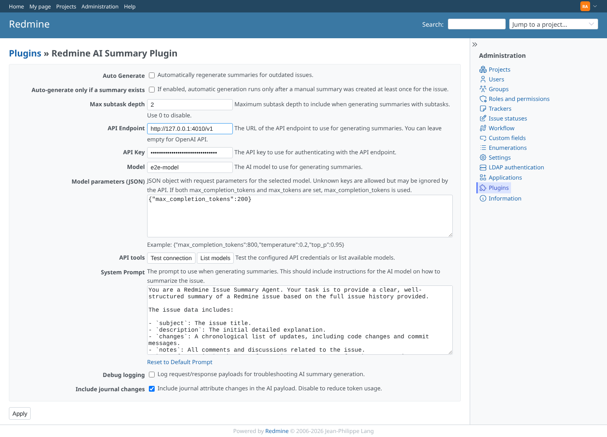
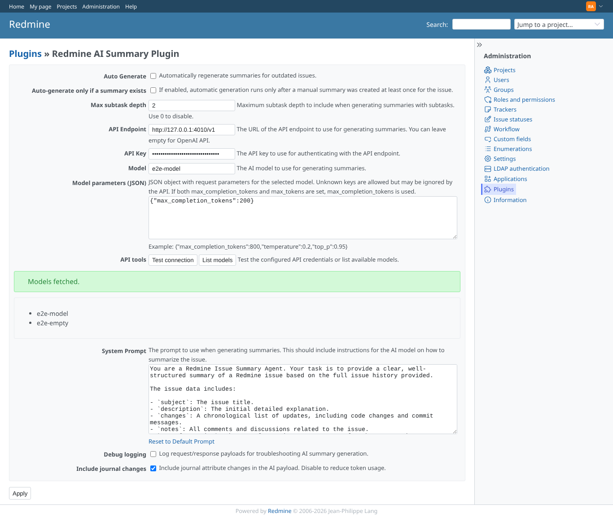
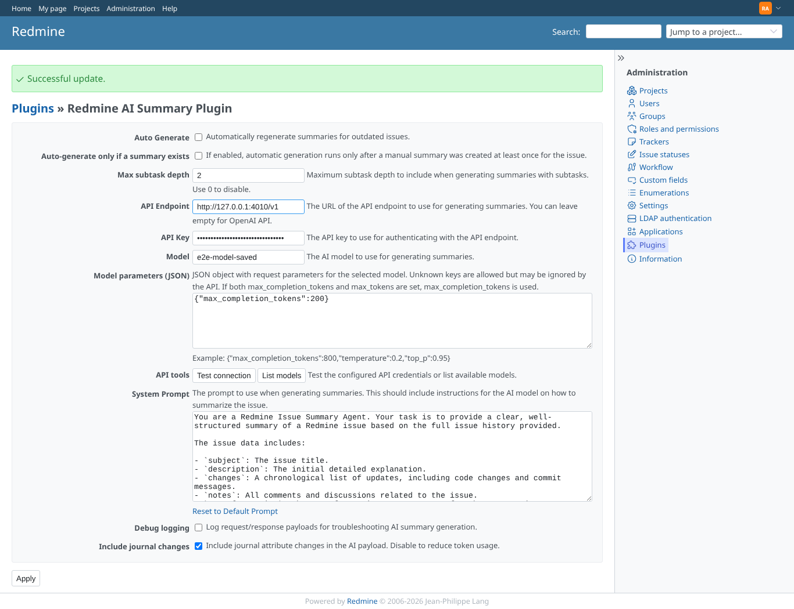
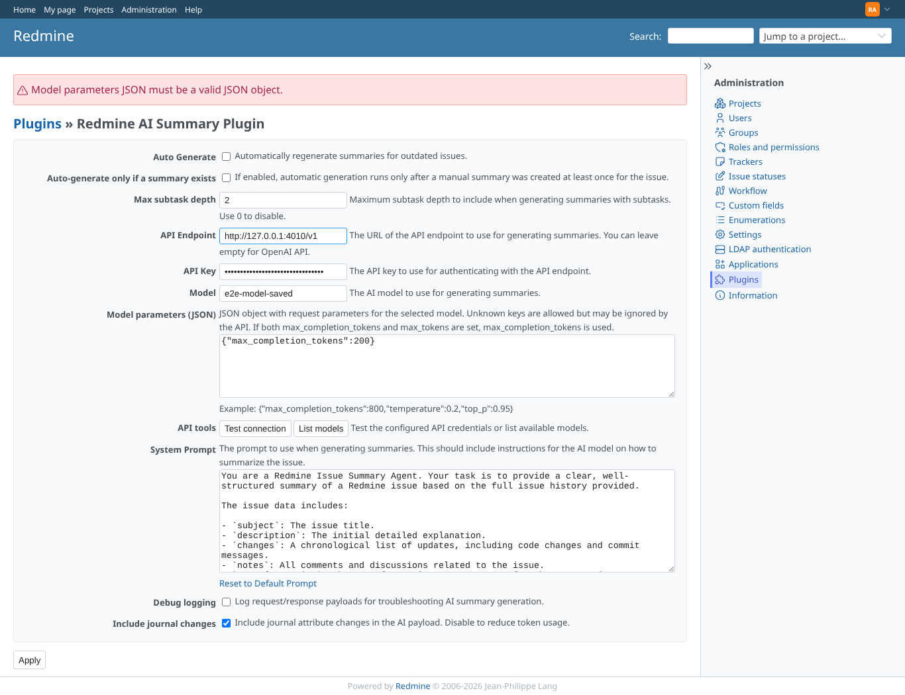
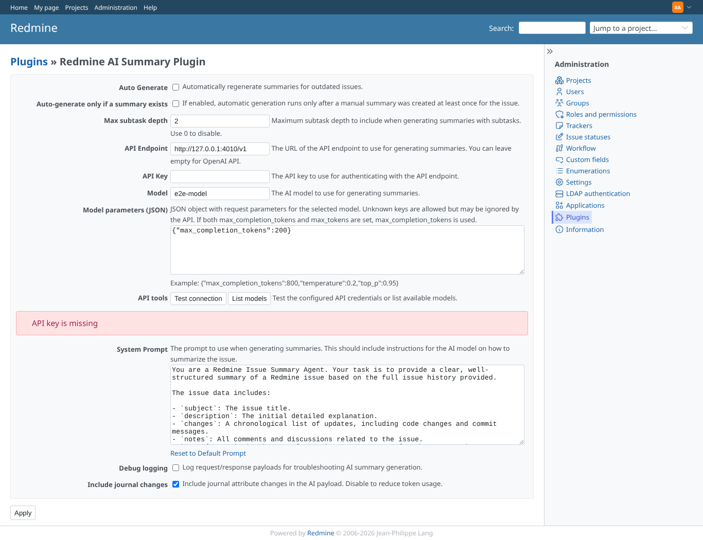

# plugin_settings

Run 2026-10-06T20:09:08.898Z against http://127.0.0.1:3000.

| screenshot | user | URL | shows |
|---|---|---|---|
|  | admin | `/settings/plugin/redmine_ai_summary` | Plugin settings as admin: endpoint, masked API key, model, model parameters JSON, the API tools, prompt and options |
|  | admin | `/settings/plugin/redmine_ai_summary` | Test connection succeeded and List models shows the provider's models (e2e-model, e2e-empty) |
|  | admin | `/settings/plugin/redmine_ai_summary` | Saved with the masked key untouched: "Successful update", the new model is stored and the API key is unchanged |
|  | admin | `/settings/plugin/redmine_ai_summary` | Invalid model parameters JSON: refused with an error message, the stored settings are unchanged |
|  | admin | `/settings/plugin/redmine_ai_summary` | Test connection without an API key: "API key is missing", nothing sent |
|  | manager | `/settings/plugin/redmine_ai_summary` | Manager (not admin): the plugin settings page is refused (403) |
