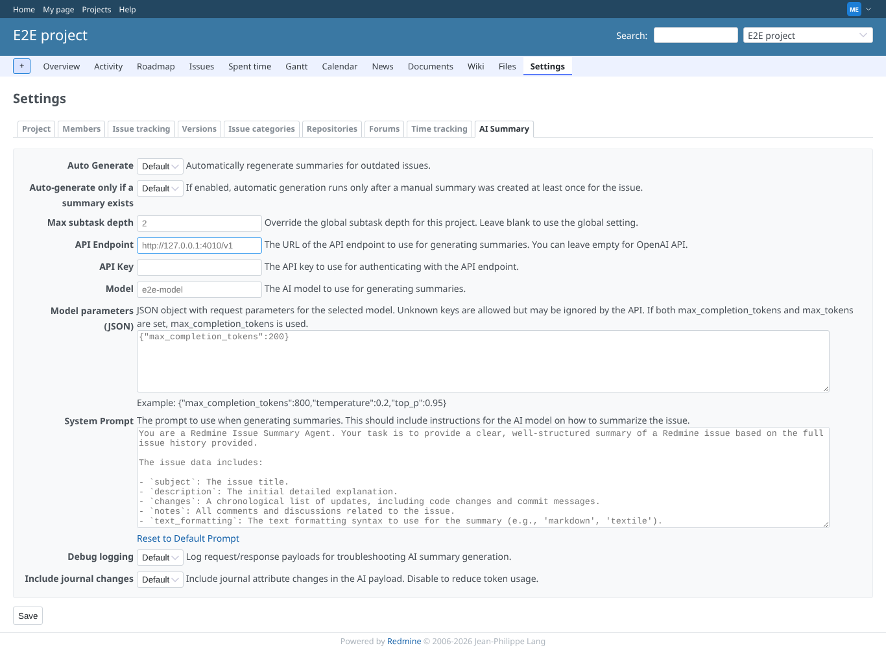
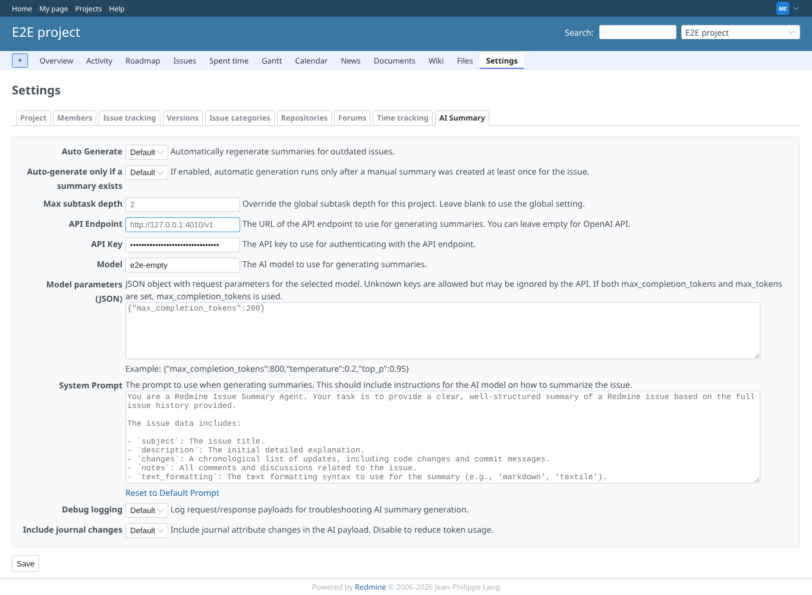
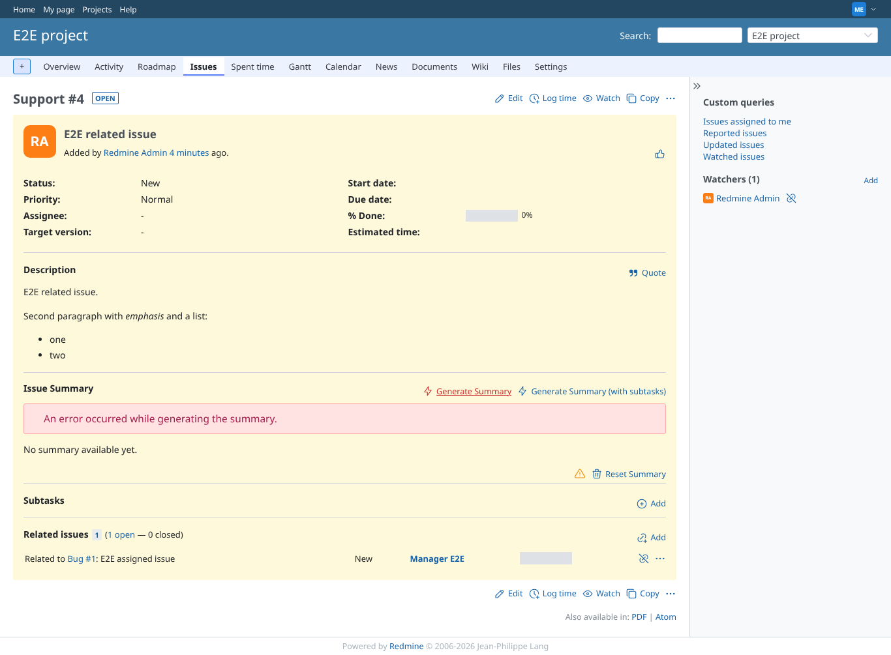
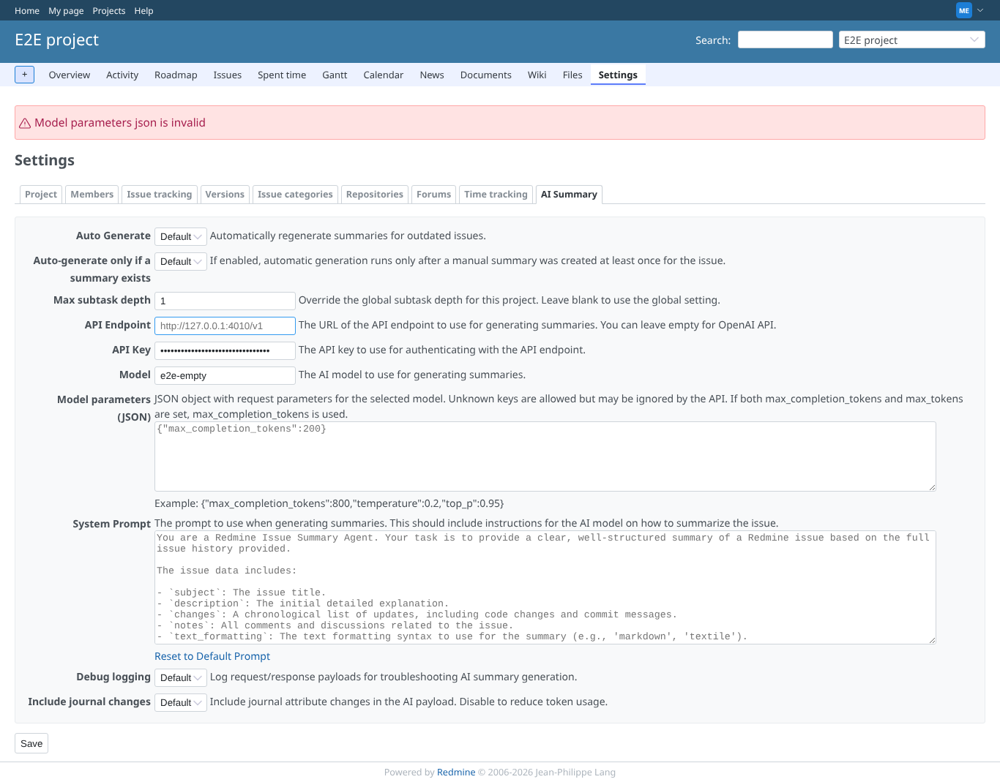
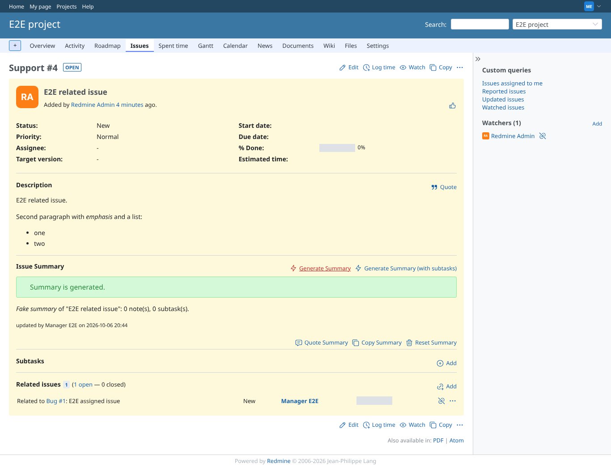
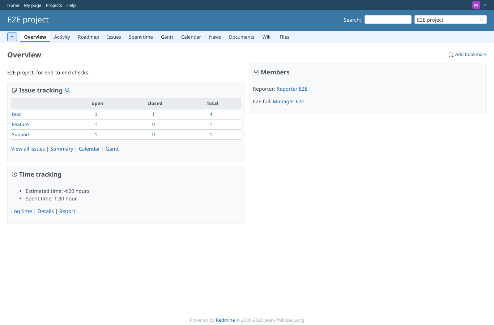

# project_settings

Run 2026-10-06T20:44:57.940Z against http://127.0.0.1:3000.

| screenshot | user | URL | shows |
|---|---|---|---|
|  | manager | `/projects/e2e-project/settings/ai_summary` | Manager: project settings render again with the module on; the AI summary tab, every field on "inherit" with the global value as placeholder |
|  | manager | `/projects/e2e-project/settings/ai_summary` | Overrides saved: the model shows e2e-empty, the project API key is masked |
|  | manager | `/issues/4` | Generation in this project used the project model (e2e-empty): the fake provider answered empty content |
|  | manager | `/projects/e2e-project/settings/ai_summary` | Invalid model parameters JSON in the project: refused with an error message, nothing stored |
|  | manager | `/issues/4` | Overrides cleared ("inherit"): generation uses the global model again and succeeds |
|  | reporter | `/projects/e2e-project` | Reporter (no manage permission): the project page shows no Settings tab; PUT to the AI summary settings answers 403 |
|  | outsider | `/projects/e2e-private/settings/ai_summary` | Outsider: the private project settings are refused (403) |
