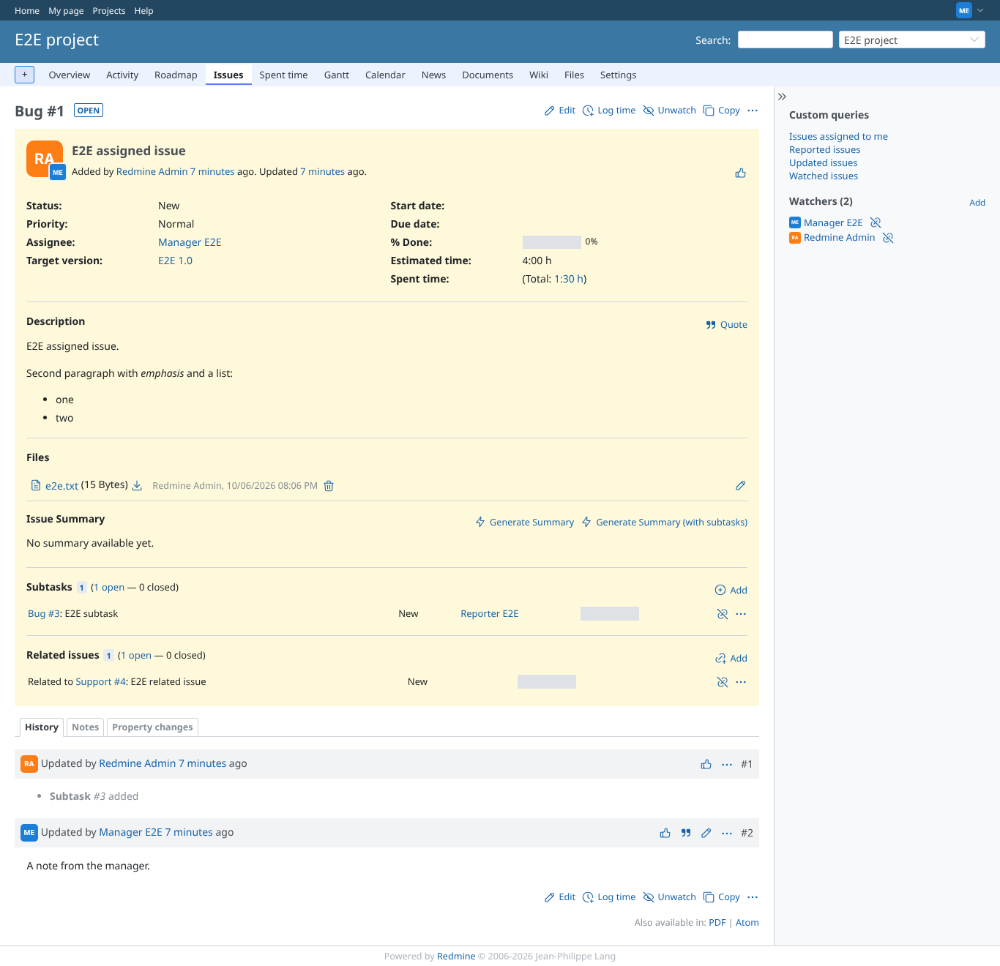
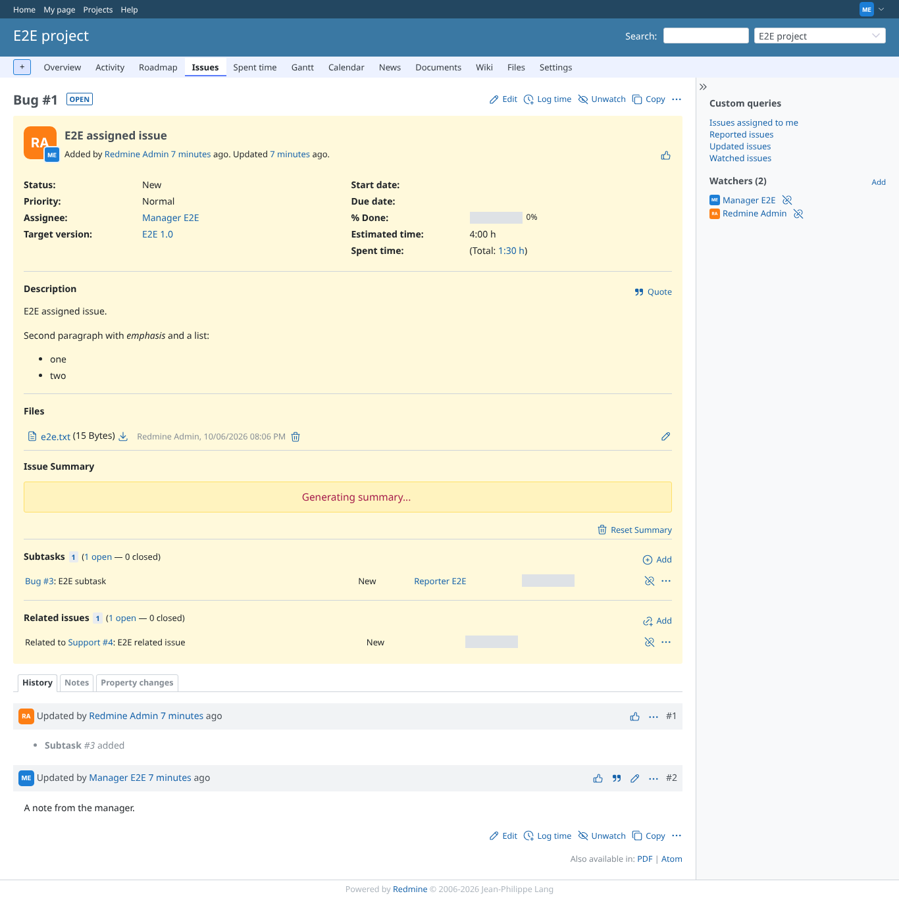
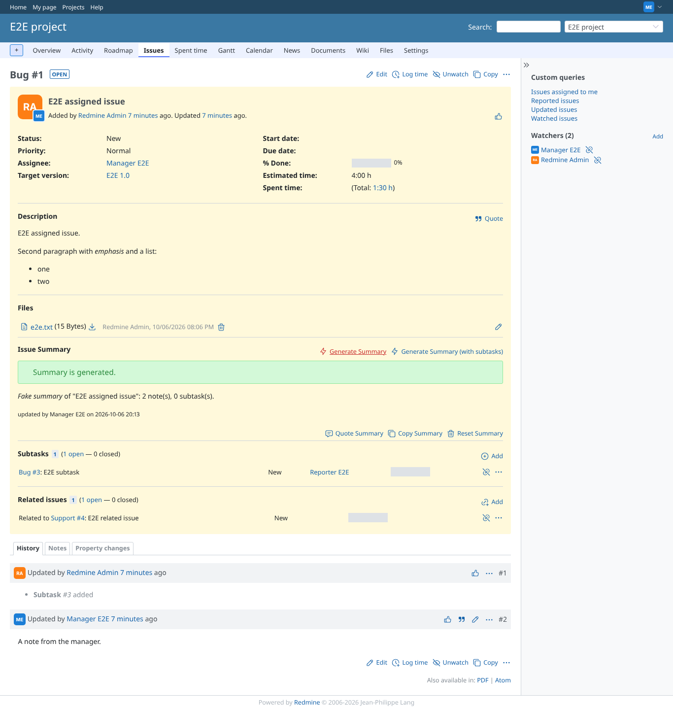
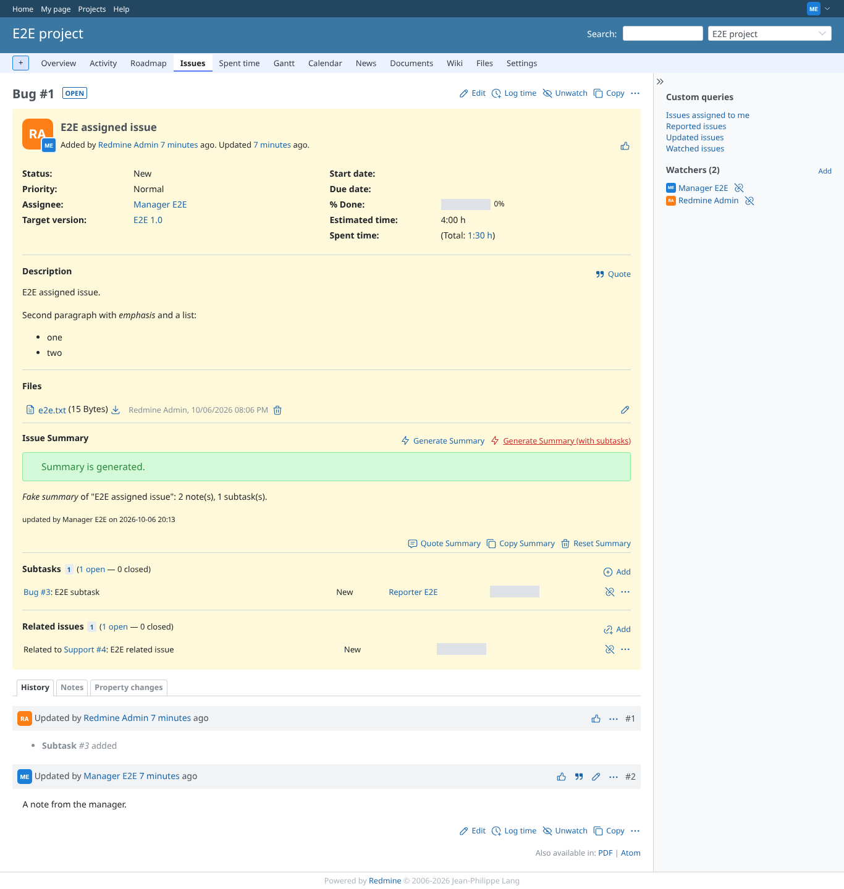
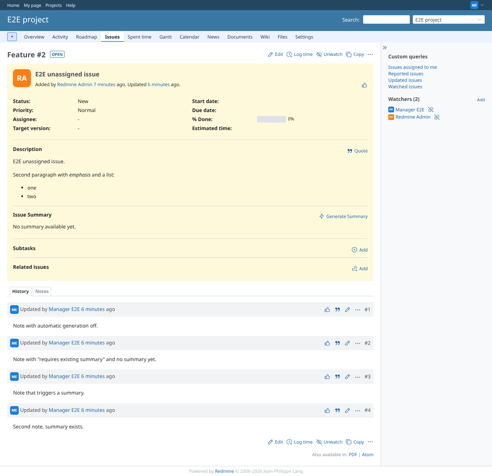
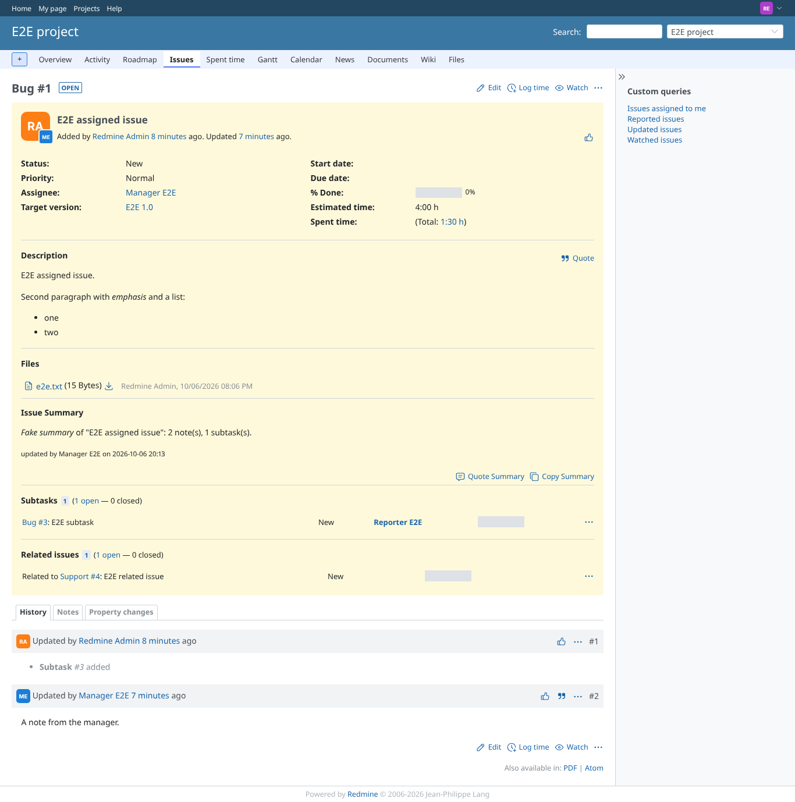
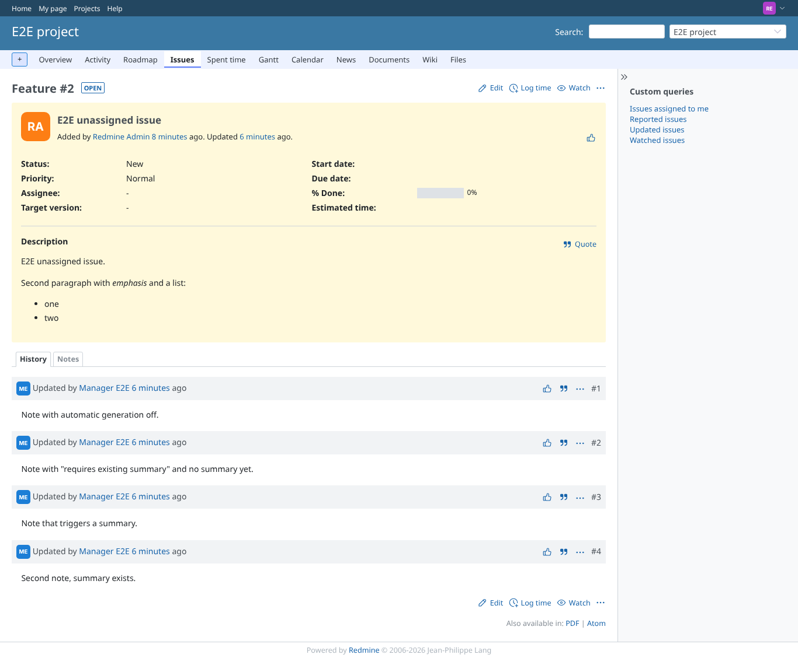
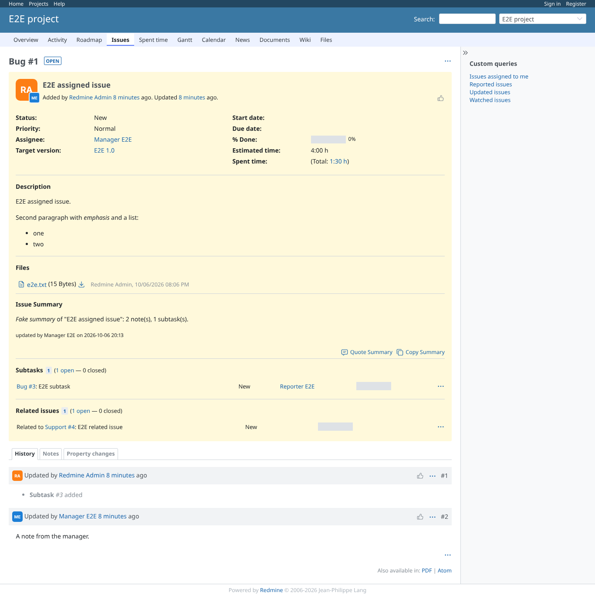
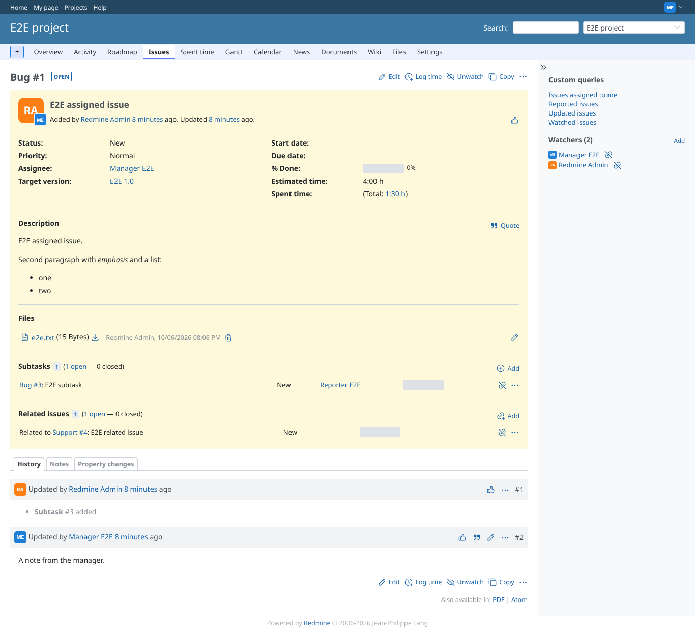

# summary_generate

Run 2026-10-06T20:14:17.948Z against http://127.0.0.1:3000.

| screenshot | user | URL | shows |
|---|---|---|---|
|  | manager | `/issues/1` | Manager, no summary yet: the empty state and both generate buttons, each with its SVG icon |
|  | manager | `/issues/1` | Manager clicked Generate Summary: the block shows that the summary is being generated |
|  | manager | `/issues/1` | Polling replaced the block with the generated summary (rendered as wiki text), the "updated by" line and the quote, copy and delete actions |
|  | manager | `/issues/1` | Generate Summary (with subtasks): the request carried the subtask, the summary counts 1 subtask |
|  | manager | `/issues/2` | Subtask depth 0 in the plugin settings: only Generate Summary is offered |
|  | reporter | `/issues/1` | Reporter (no plugin permissions): sees the summary through the public view permission, no generate or delete actions |
|  | reporter | `/issues/2` | Reporter on an issue without a summary: nothing to show and nothing allowed, so no summary block |
|  | reporter | `/issues/7` | Reporter on a private issue of the public project: core refuses the issue (403) |
|  | anonymous | `/issues/1` | Anonymous on a public issue: the summary is readable (public view permission), no actions |
|  | outsider | `/issues/6` | Outsider: an issue of the private project and its summary endpoint are refused (403) |
|  | manager | `/issues/1` | AI summary module disabled in the project: no summary block, and the content endpoint answers 403 |
