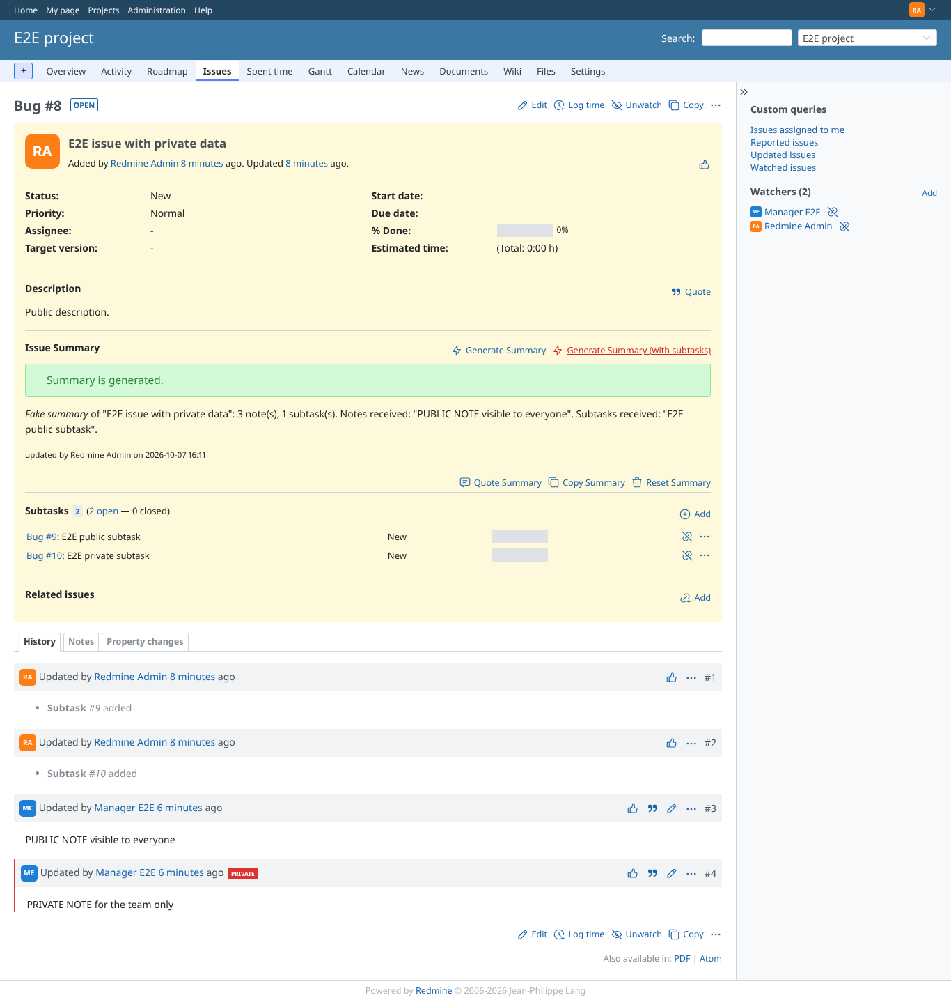
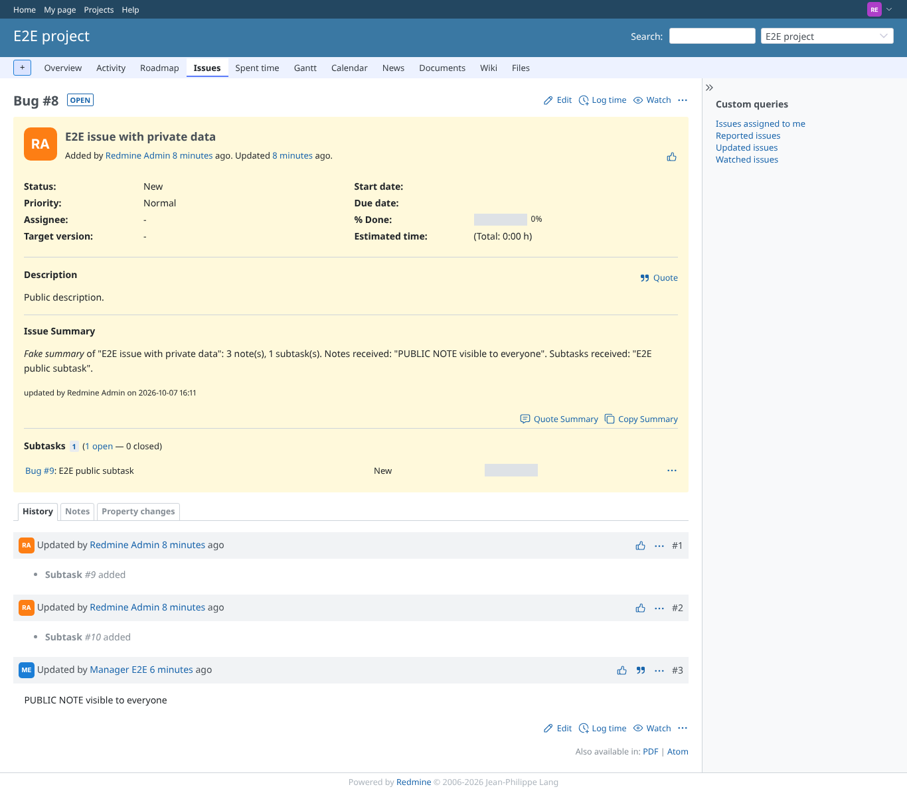
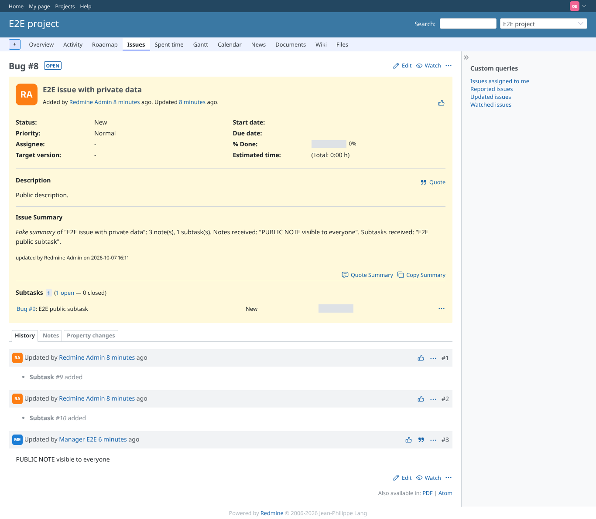

# private_data

Run 2026-10-07T16:12:05.273Z against http://127.0.0.1:3000.

| screenshot | user | URL | shows |
|---|---|---|---|
|  | manager | `/issues/8` | Manager sees the private note and the private subtask on the issue, yet the summary (generated with subtasks) received only the public note and the public subtask |
|  | admin | `/issues/8` | Admin generates: still only the public note and public subtask were sent |
|  | reporter | `/issues/8` | Reporter (no view_private_notes): the private note is hidden by core and the summary does not reveal it or the private subtask; generating is refused (403) |
|  | outsider | `/issues/8` | Outsider (no membership, public project): reads the summary, which holds no private data; the private subtask and generating are refused (403) |
|  | outsider | `/issues/10` | Outsider: the private subtask itself is refused (403) |
