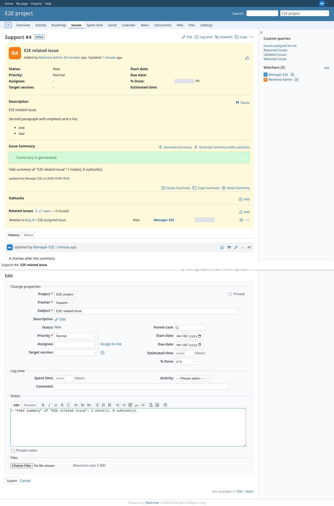
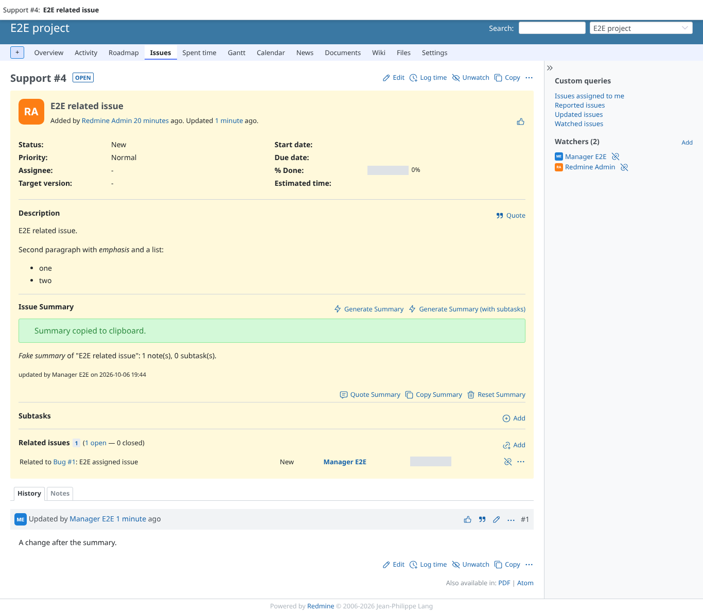
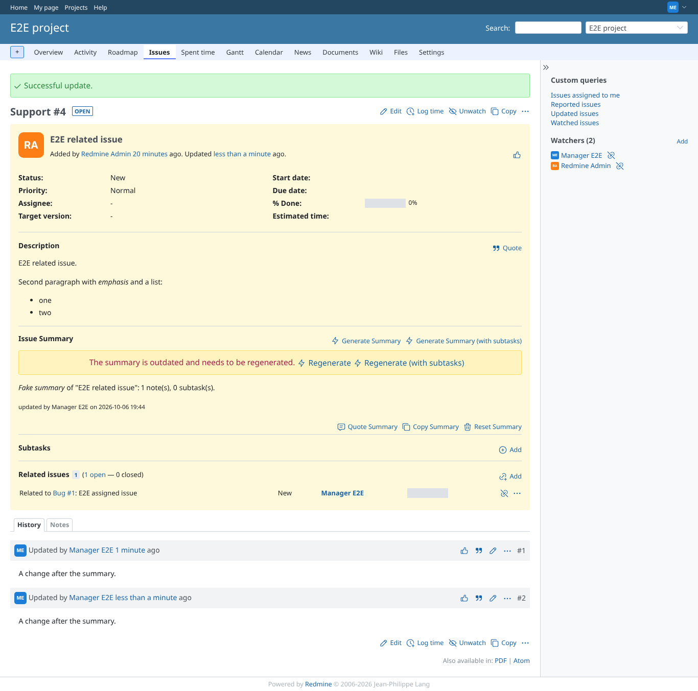
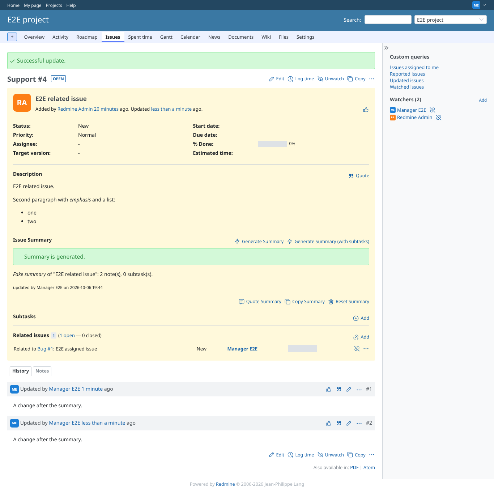
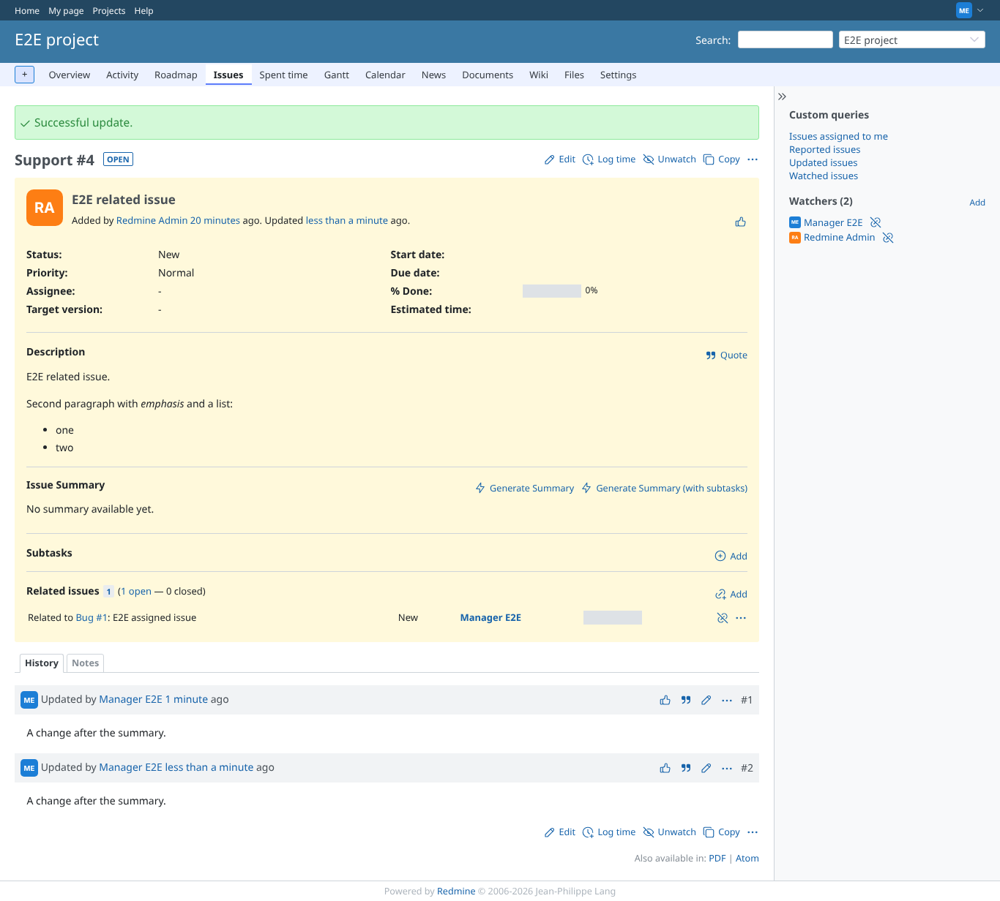

# summary_actions

Run 2026-10-06T19:44:33.969Z against http://127.0.0.1:3000.

| screenshot | user | URL | shows |
|---|---|---|---|
|  | manager | `/issues/4` | Quote Summary opened the edit form and put the summary, quoted with "> ", into the notes |
|  | manager | `/issues/4` | Copy Summary put the summary on the clipboard and shows a short notice |
|  | manager | `/issues/4` | After a note the summary is marked stale, with Regenerate and Regenerate (with subtasks) |
|  | manager | `/issues/4` | Regenerate produced a fresh summary; the stale warning is gone |
|  | manager | `/issues/4` | Reset Summary (after the confirmation) deleted the summary: back to "No summary available yet." |
