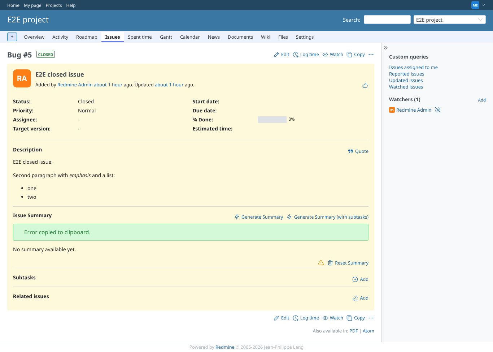
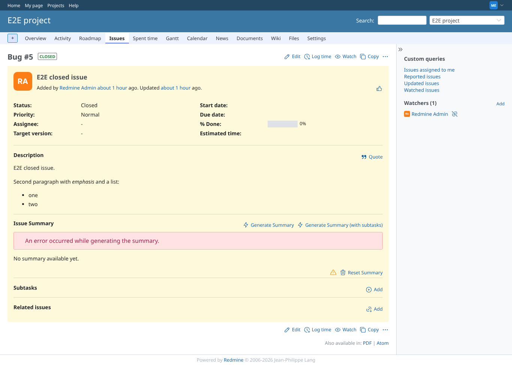
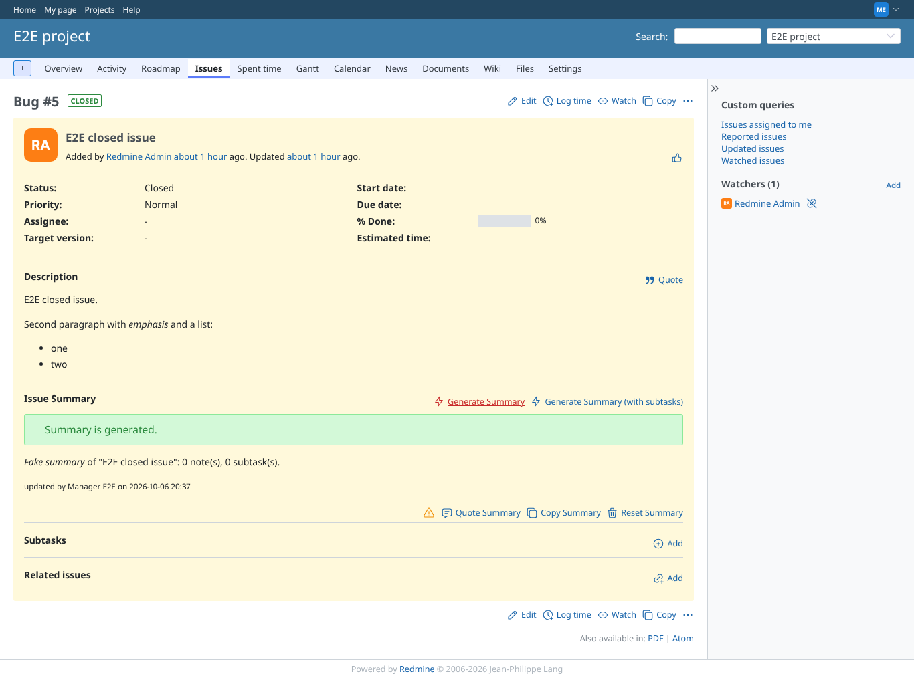

# summary_failures

Run 2026-10-06T20:37:27.022Z against http://127.0.0.1:3000.

| screenshot | user | URL | shows |
|---|---|---|---|
|  | manager | `/issues/5` | No API key: the failed state and the warning marker; its message (checked, not visible in the picture) is "API key is missing.", and the fake provider received no request |
|  | manager | `/issues/5` | Clicking the warning marker copies the error message and shows a notice |
|  | manager | `/issues/5` | Provider refuses the key (HTTP 401): failed state; marker message "the server responded with status 401 for POST http://127.0.0.1:4010/v1/chat/comp" |
|  | manager | `/issues/5` | Provider answers with empty content: failed state, "AI Summary returned empty content" |
|  | manager | `/issues/5` | Endpoint does not answer: failed state with the connection error; the issue page still works |
|  | manager | `/issues/5` | Debug logging on: the summary is generated and the marker holds the request and response payload |
